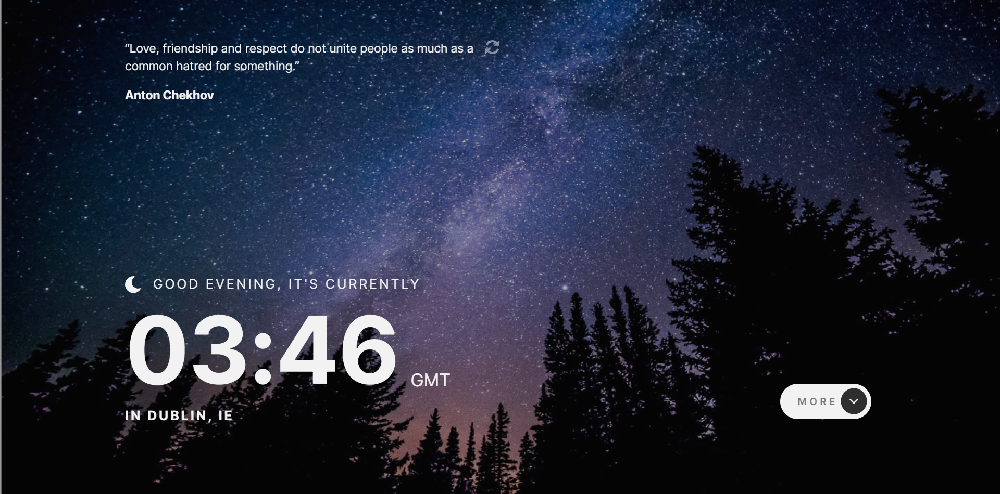

# Frontend Mentor - Clock app solution

This is a solution to the [Clock app challenge on Frontend Mentor](https://www.frontendmentor.io/challenges/clock-app-LMFaxFwrM). Frontend Mentor challenges help you improve your coding skills by building realistic projects. 

## Table of contents

- [Overview](#overview)
  - [The challenge](#the-challenge)
  - [Screenshot](#screenshot)
  - [Links](#links)
- [My process](#my-process)
  - [Built with](#built-with)
  - [Useful resources](#useful-resources)
- [Author](#author)
- [Acknowledgments](#acknowledgments)

## Overview

### The challenge

Users should be able to:

- View the optimal layout for the site depending on their device's screen size
- See hover states for all interactive elements on the page
- View the current time and location information based on their IP address
- View additional information about the date and time in the expanded state
- Be shown the correct greeting and background image based on the time of day they're visiting the site
- Generate random programming quotes by clicking the refresh icon near the quote

### Screenshot

### Links

- Solution URL: [https://github.com/awsmPuff/clock-app](https://github.com/awsmPuff/clock-app)
- Live Site URL: [https://awsmpuff.github.io/clock-app/](https://awsmpuff.github.io/clock-app/)

## My process

### Built with

- Semantic HTML5 markup
- SASS
- Flexbox
- Mobile-first workflow

### Useful resources

- [IP Geolocation API](https://ipgeolocation.io/) - Get current location details with or without ip.
- [Quote API](https://github.com/lukePeavey/quotable) - Get random quotes and authors, etc.
- [World Time API](http://worldtimeapi.org/) - Set time based on IP address, and also get info like the day of the year shown in the expanded state.

## Author

- Website - [Wanxia Xie/Laurenxx](https://www.your-site.com)
- Frontend Mentor - [@awsmPuff](https://www.frontendmentor.io/profile/awsmPuff)

